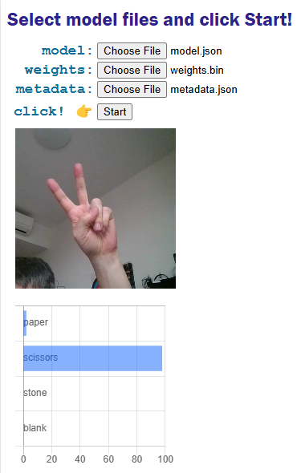

# tm_related

Teachable Machineに関連したmaterialを上げる場所として作成。

### Dec15, 2024

[Teachable Machineで機械学習その２：localに保存したmodelファイルをブラウザで使う](https://makeintoshape.com/teachable-machine-local-model/)

- tm-image_local.html

モデルファイルをuploadして、そのリンクを使うやり方はよく見られるのだが、localに保存したモデルファイルを使う方法がなかなか見つからずに苦労した。Javascriptはlocalのファイルを勝手に読むようなことはしないように作られている。何らかのuser actionを介さなければそれをしない。この点を理解していなかったことが無駄な努力の原因であった。

上のhtmlを書くにあたり、ぽむたさんのゴクリAIの記事が大変面白くためになった。

- [【簡単】TeachableMachineを利用して「ゴクリAI認識」webアプリを作ろう](https://qiita.com/PoodleMaster/items/f08805bcf4e7596ba25b)

- [gokuri counter](https://github.com/PoodleMaster/gokuri_counter)

